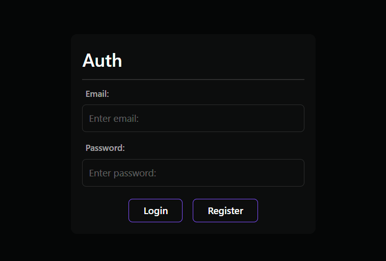
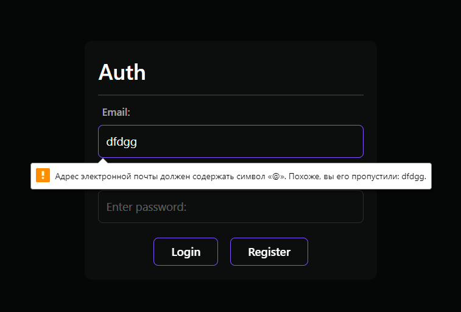
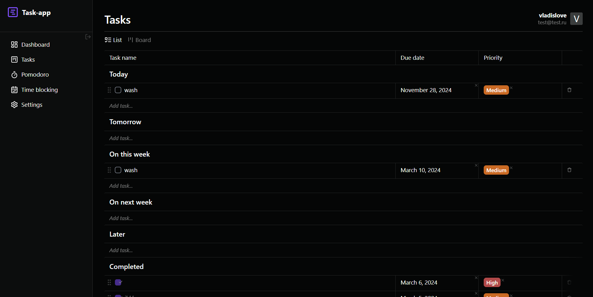
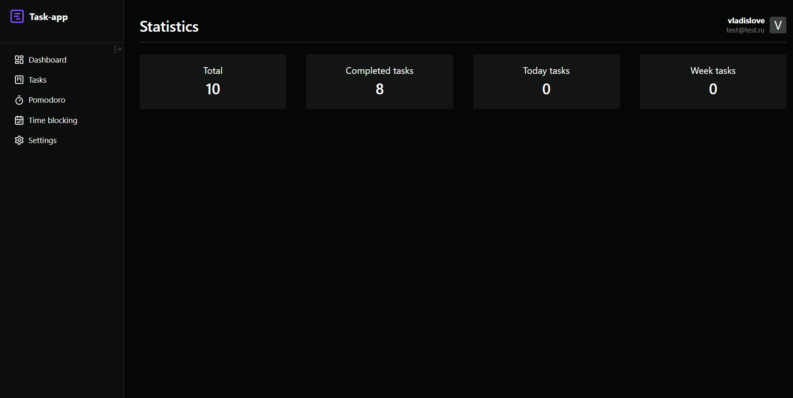
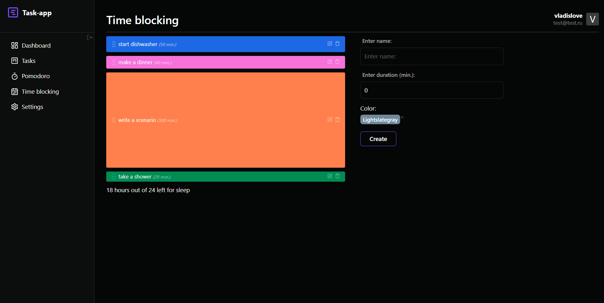
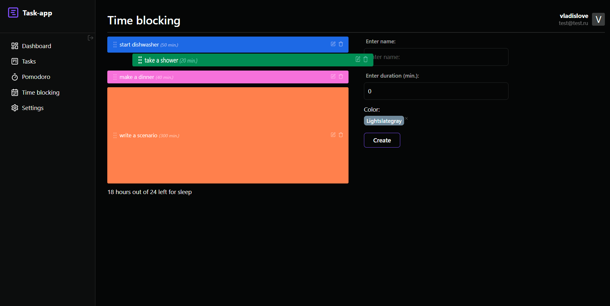
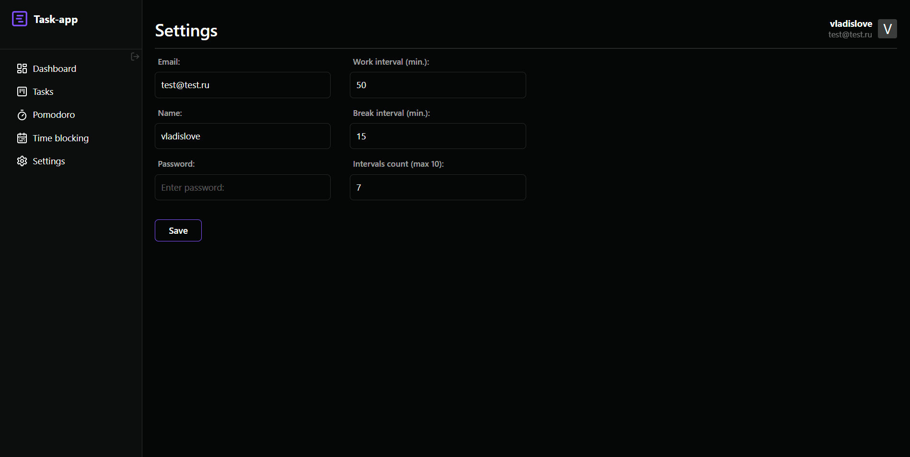
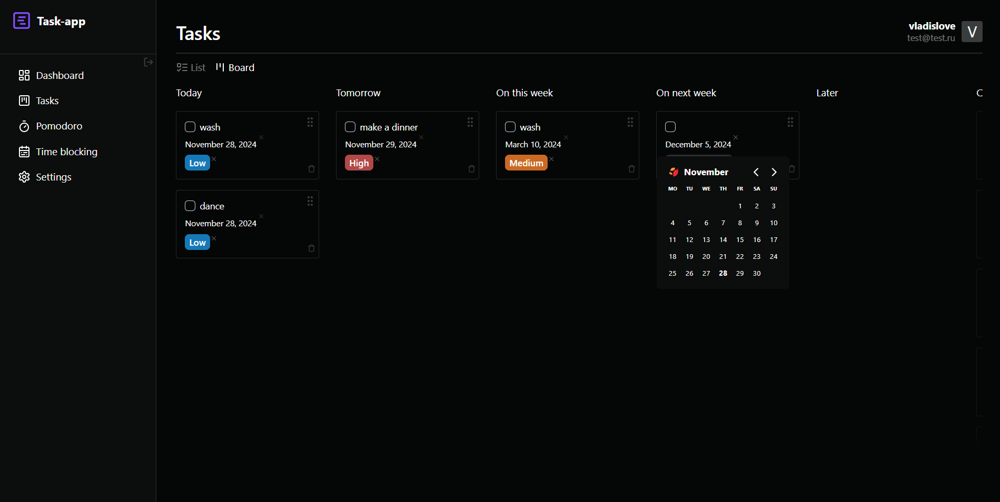

<!-- markdownlint-disable MD033 MD041 -->

  <h1 align="center">📒 Project Planner</h1>

  <i>Demo project</i>

  <h2 align="start">🔐Регистрация и аутентификация пользователя</h1>

  <ul>
    <li>На проекте используется механизм JWT-авторизации</li>
    <li>Форма с валидацией почтового ящика и пароля при помощи библиотеки react-hook-form</li>
  </ul>

  
  

  <h2 align="center">Основной функционал</h1>

  
  
  
  
  
  
  

<!-- markdownlint-enable MD033 -->
